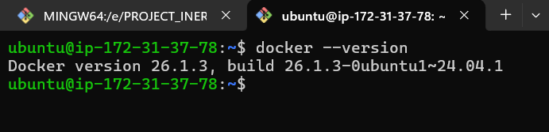
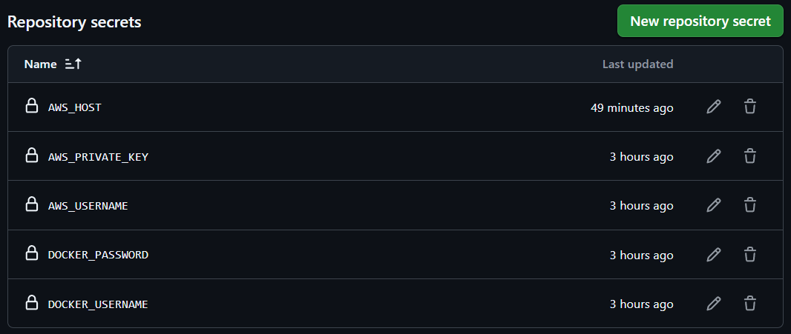
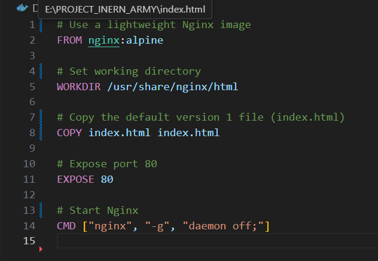
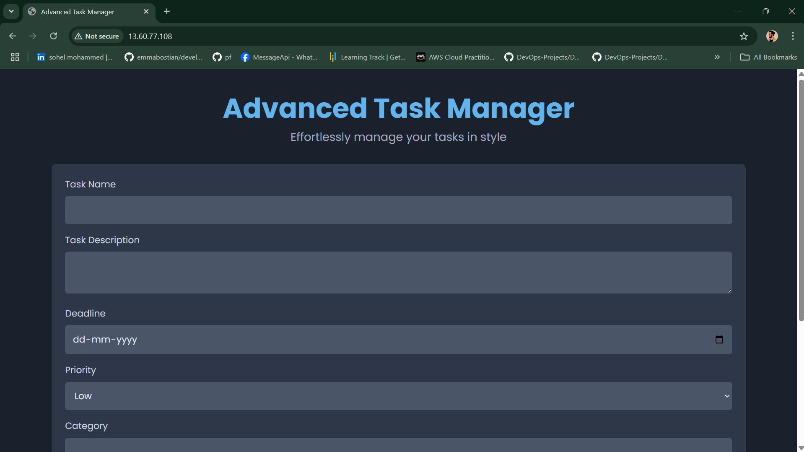
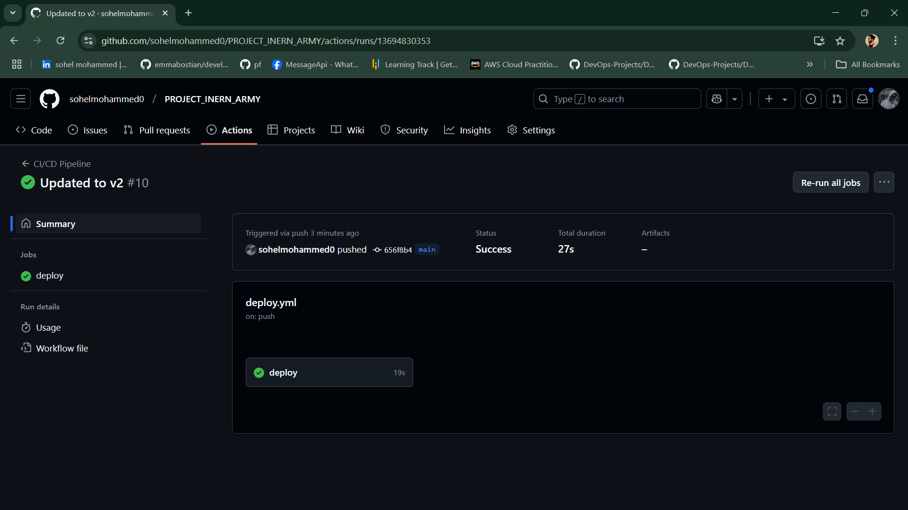
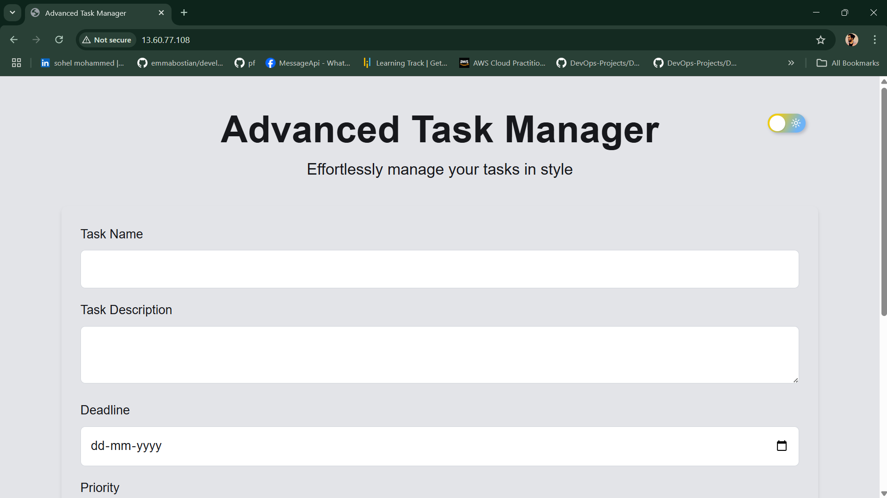

# **Automated CI/CD Pipeline for Deploying a Web Application on AWS using Docker & GitHub Actions**

## **📌 Project Overview**
This project demonstrates a fully automated **CI/CD pipeline** using **Git, GitHub Actions, Docker, and AWS**. The pipeline automates the process of building, pushing, and deploying a Docker containerized web application to an AWS EC2 instance whenever changes are pushed to the **main branch** in GitHub.

## **📜 Table of Contents**
- [Pre-requisites](#pre-requisites)
- [Technologies Used](#technologies-used)
- [Project Workflow](#project-workflow)
- [Setting Up AWS EC2 Instance](#setting-up-aws-ec2-instance)
- [Configuring GitHub Secrets](#configuring-github-secrets)
- [Creating the GitHub Actions Workflow](#creating-the-github-actions-workflow)
- [Dockerfile Configuration](#dockerfile-configuration)
- [Triggering the CI/CD Pipeline](#triggering-the-ci/cd-pipeline)
- [Testing the Deployment](#testing-the-deployment)
- [Conclusion](#conclusion)

---

## **✅ Pre-requisites**
Before starting, ensure you have the following:
1. **GitHub Repository** for storing the project files.
2. **Docker Hub Account** to store and manage container images.
3. **AWS EC2 Instance** (Ubuntu) for deploying the application.
4. **Domain or Public IP** to access the deployed web app.
5. **Basic knowledge of Docker & CI/CD concepts.**

---

## **🛠 Technologies Used**
- **Git** - Version control system
- **GitHub** - Code repository hosting and GitHub Actions for CI/CD
- **Docker** - Containerization of the web application
- **AWS EC2** - Cloud infrastructure for hosting the app
- **Nginx** - Web server for serving the static files
- **GitHub Actions** - Automating build, push, and deployment
- **SSH & SCP** - Secure connection and file transfers to EC2

---

## **🔄 Project Workflow**
1. **Developer commits & pushes changes** to GitHub.
2. **GitHub Actions triggers a workflow** to build a new Docker image.
3. **Docker image is pushed to Docker Hub.**
4. **GitHub Actions connects to the EC2 instance** using SSH.
5. **Old container is stopped & removed.**
6. **New container is pulled from Docker Hub & deployed.**
7. **Application is accessible via EC2's public IP.**

---

## **🖥 Setting Up AWS EC2 Instance**
1. **Launch an EC2 instance** on AWS with **Ubuntu 22.04 LTS**.

")

2. **Install Docker on EC2:**
   ```sh
   sudo apt update
   sudo apt install -y docker.io
   sudo systemctl start docker
   sudo systemctl enable docker
   ```




3. **Allow EC2 to run Docker without sudo:**
   ```sh
   sudo usermod -aG docker ubuntu
   ```
4. **Open port 80** in AWS Security Group to allow access to the web app.

---

## **🔐 Configuring GitHub Secrets**
To securely store credentials, go to **GitHub Repository > Settings > Secrets** and add the following:

| Secret Name            | Description                         |
|------------------------|-------------------------------------|
| `DOCKER_USERNAME`      | Your Docker Hub username           |
| `DOCKER_PASSWORD`      | Your Docker Hub Personal Access Token (PAT) |
| `AWS_HOST`            | Public IP of your EC2 instance     |
| `AWS_USERNAME`        | Default user for Ubuntu (usually `ubuntu`) |
| `AWS_PRIVATE_KEY`     | Your EC2 private key for SSH access |

---




## **📝 Creating the GitHub Actions Workflow**
Create a `.github/workflows/main.yml` file in your repository and add the following:

```yaml
name: CI/CD Pipeline

on:
  push:
    branches:
      - main

jobs:
  deploy:
    runs-on: ubuntu-latest

    steps:
      - name: Checkout Repository
        uses: actions/checkout@v3

      - name: Login to Docker Hub
        run: echo "${{ secrets.DOCKER_PASSWORD }}" | docker login -u "${{ secrets.DOCKER_USERNAME }}" --password-stdin

      - name: Build and Push Docker Image
        run: |
          docker build -t ${{ secrets.DOCKER_USERNAME }}/webapp:latest .
          docker tag ${{ secrets.DOCKER_USERNAME }}/webapp:v2
          docker push ${{ secrets.DOCKER_USERNAME }}/webapp:latest
          docker push ${{ secrets.DOCKER_USERNAME }}/webapp:v2

      - name: Deploy to AWS EC2
        uses: appleboy/ssh-action@v0.1.10
        with:
          host: ${{ secrets.AWS_HOST }}
          username: ${{ secrets.AWS_USERNAME }}
          key: ${{ secrets.AWS_PRIVATE_KEY }}
          script: |
            docker stop webapp || true
            docker rm webapp || true
            docker pull ${{ secrets.DOCKER_USERNAME }}/webapp:latest
            docker run -d -p 80:80 --name webapp ${{ secrets.DOCKER_USERNAME }}/webapp:latest
            echo "Deployment successful!"
```

---

## **📦 Dockerfile Configuration**
Ensure you have a **Dockerfile** in your repository:

```dockerfile
FROM nginx:latest
COPY index.html /usr/share/nginx/html/index.html
```




This will serve **index.html** as `index.html` via Nginx. (Version 1)




---


## **🚀 Triggering the CI/CD Pipeline**
1. Push changes to the `main` branch:
   ```sh
   git add .
   git commit -m "Updated index.html"
   git push origin main
   ```
2. GitHub Actions will automatically:
   - Build & tag a new Docker image.
   - Push the image to Docker Hub.
   - Deploy the new version to AWS EC2.

---




## **🛠 Testing the Deployment**
Once deployment is successful, access your web application by visiting:
```
http://<YOUR_EC2_PUBLIC_IP>
```
This will serve **index.html** (updated) as `index.html` via Nginx. (Version 2)




To verify the container is running on EC2:
```sh
docker ps
```
To check the contents of the deployed app:
```sh
docker exec -it webapp sh
ls /usr/share/nginx/html/
```
You should see `index.html` (which contains the content of `index.html`).

---

## **📌 Conclusion**
This project successfully sets up an automated CI/CD pipeline using **GitHub Actions, Docker, and AWS**. The pipeline ensures that every change pushed to GitHub is automatically built, tested, and deployed to an AWS EC2 instance, providing a seamless DevOps workflow.

✅ **Key Takeaways:**
- Automated Docker image build and push to **Docker Hub**.
- Continuous deployment to **AWS EC2** using **GitHub Actions**.
- **Nginx** used as a web server to serve static files.
- Secure **SSH-based deployment** with **GitHub Secrets**.

This setup is ideal for deploying **small-to-medium scale web applications** efficiently. 🚀🎉

